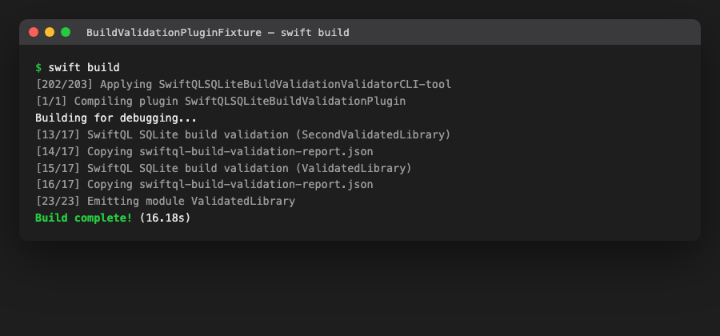
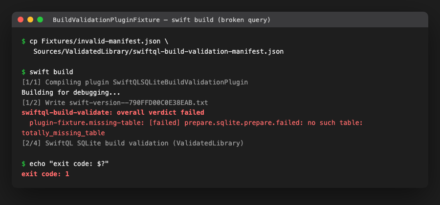

# SwiftPM Build-Tool Plugin (#294)

This is the thin SwiftPM build-tool plugin wrapper recommended by the
[#132 research](SQLiteBuildValidation.md) and produced by
[#294](https://github.com/lukevanin/swiftql/issues/294), invoking the
[#293 standalone validator](SQLiteBuildValidationValidator.md) as a normal
part of `swift build`. The plugin owns no validation logic, schema
inference, or report format of its own — it only declares inputs/outputs
and runs the already-built `swiftql-build-validate` executable.

## Package surface

`SwiftQLSQLiteBuildValidationPlugin` (`Plugins/SwiftQLSQLiteBuildValidationPlugin`)
is a `.plugin(capability: .buildTool())` target, exposed as a product of the
same name, depending on the `swiftql-build-validate` executable target so it
can resolve the validator's built path via `context.tool(named:)`.

That executable's target name and its product name are both
`swiftql-build-validate`, and they have to stay identical — see
[Build systems](#build-systems) below.

## Opting in

A target opts in by listing the plugin in its `plugins: [...]` array and
placing exactly two files directly in the target's own source directory
(the same directory as its `.swift` files):

- `swiftql-build-validation-manifest.json` — a [#292 manifest](SQLiteBuildValidationManifest.md)
  in canonical JSON form.
- `swiftql-build-validation-snapshot.sqlite` — the checked-in SQLite
  snapshot the manifest's `schema_snapshot` field describes.

```swift
.target(
    name: "MyTarget",
    plugins: [
        .plugin(name: "SwiftQLSQLiteBuildValidationPlugin", package: "SwiftQL"),
    ]
)
```

If a target lists the plugin but is missing either file, the plugin throws
a clear, descriptive error naming the missing file(s) rather than silently
skipping validation — a target either fully opts in or the build fails with
an explanation.

SwiftPM does not require plugin-configuration files like these to be
declared as `resources:`; expect a benign "found N file(s) which are
unhandled" build note for them, since they are inputs to the plugin, not
bundle resources for the target's own product.

## Quick start

1. Add the plugin to a target's `plugins: [...]` array (see
   [Opting in](#opting-in) above).
2. Place `swiftql-build-validation-manifest.json` (a
   [#292 manifest](SQLiteBuildValidationManifest.md)) and
   `swiftql-build-validation-snapshot.sqlite` (the schema snapshot it
   describes) directly in that target's own source directory.
3. Run `swift build`. On a clean build, or after either file changes, the
   plugin runs `swiftql-build-validate` before the target compiles:

   

   A report per target lands under
   `.build/plugins/outputs/<package>/<target>/destination/SwiftQLSQLiteBuildValidationPlugin/<target>/swiftql-build-validation-report.json`
   — the `<target>` component appears twice: once from SwiftPM's own
   per-target plugin-output directory, and once more because the plugin
   itself appends `target.name` to `context.pluginWorkDirectory` (see
   [What the plugin declares](#what-the-plugin-declares)).

4. If a query stops matching the snapshot, the build fails at that step and
   forwards the validator's diagnostic directly to `swift build`'s output —
   no separate report-inspection step needed:

   

5. Rebuilding with no changes skips validation entirely (SwiftPM sees the
   command's declared inputs are unchanged); fixing the manifest or snapshot
   and rebuilding re-runs it and restores a passing build.

For a self-contained, runnable version of this walkthrough see
`IntegrationTests/BuildValidationPluginFixture` and its `verify.sh`, which
drives exactly these steps against the real pinned Northwind snapshot and runs
on every cell of the pinned compatibility matrix in CI. `verify-xcode.sh` next
to it drives the same steps through Xcode's build system (see
[Build systems](#build-systems)); that one stays a manual check, because Xcode
is not part of the pinned matrix.

## Package layout example

See `IntegrationTests/BuildValidationPluginFixture` for a complete, runnable
example: a standalone SwiftPM package depending on this repository by local
path, with one target (`ValidatedLibrary`) that opts into the plugin against
the real pinned Northwind snapshot. `verify.sh` in that directory drives
`swift build` through both a valid and an invalid manifest and asserts on
exit codes, forwarded diagnostics, and incremental-build behavior, and
`verify-xcode.sh` drives the valid/invalid pair through `xcodebuild` — these
are the plugin's invocation-contract tests, since a build-tool plugin's
`createBuildCommands` cannot be meaningfully unit-tested without a live
`PluginContext` supplied by SwiftPM itself.

## What the plugin declares

For each opted-in target, `createBuildCommands` returns exactly one
`.buildCommand` (never a `.prebuildCommand` — a hard constraint of #294,
since prebuild commands hide their real inputs/outputs from SwiftPM's
incremental planner):

- **Input files**: the manifest and the snapshot, both explicit `Path`
  values.
- **Output files**: one canonical report JSON file, written under the
  plugin's own work directory (`context.pluginWorkDirectory`).
- **Executable**: the built `swiftql-build-validate` tool, resolved via
  `context.tool(named:)` — never a raw shell invocation or a path assumed
  from convention.
- **Arguments**: `--database <snapshot>`, `--manifest <manifest>`,
  `--output <report>` — exactly the standalone CLI's existing, already-shipped
  contract from #293. The plugin adds no flags of its own.

## Incremental invalidation and clean-build behavior

SwiftPM's build system (not the plugin) owns invalidation: a `.buildCommand`
re-runs only when a declared input file's content or modification time
changes, or when a declared output is missing or stale. Verified in
`verify.sh`:

- An unchanged rebuild does not re-invoke the validator at all (the command
  is up to date).
- Touching either the manifest or the snapshot (even without a content
  change) reruns the command, and — since the validator itself is
  deterministic — produces a byte-identical canonical report.
- A `rm -rf .build` clean build always reruns validation, matching normal
  SwiftPM clean-build semantics for any build command.

## Sandbox behavior

SwiftPM runs build-tool plugin commands in a sandbox that permits reading
only the paths passed as `inputFiles` (plus certain standard system paths)
and writing only to `outputFiles` and the plugin's own work directory. This
is exactly why the manifest and snapshot are declared as `inputFiles` and
the report as an `outputFiles` entry — an undeclared path would be silently
rejected by the sandbox at the validator-process level, not just miss
incremental tracking. The plugin performs no file I/O itself beyond
`FileManager.fileExists(atPath:)` checks used to decide whether a target has
opted in; all real database/report I/O happens inside the sandboxed
`swiftql-build-validate` subprocess, matching #293's own "one dedicated
connection per run" contract.

## Forwarding diagnostics and nonzero exits

The plugin does not parse or reinterpret the validator's JSON report (a hard
constraint — no second report format). Diagnostic forwarding instead happens
at the CLI layer: `swiftql-build-validate` itself prints a short,
human-readable summary of every non-`passed` diagnostic to stderr before
exiting nonzero, and SwiftPM's build system surfaces a failing build
command's stderr directly in `swift build` output. A `failed` or
`unsupported` verdict exits `1`; the build command — and therefore
`swift build` for the whole package — fails accordingly.

## Build systems

The plugin runs under both SwiftPM's build system (`swift build`) and Xcode's,
and the two agree: a valid manifest builds, an invalid one fails with the
validator's own diagnostic. `verify.sh` covers the first and `verify-xcode.sh`
the second.

Getting Xcode to agree took one constraint on the validator's declaration.
`context.tool(named:)` resolves a build-tool plugin's tool to
`$BUILD_DIR/$CONFIGURATION/<target name>`, but Xcode's build system names a
package executable after its *product*. Through v1.5.5 those names differed:
the target was `SwiftQLSQLiteBuildValidationValidatorCLI` and the product was
`swiftql-build-validate`. Xcode then dropped the executable from the adopting
target's dependency graph — it built the validator's *library* dependencies but
never the executable itself — and every plugin-adopting target failed with:

```
Build input file cannot be found:
'.../Build/Products/Debug/SwiftQLSQLiteBuildValidationValidatorCLI'.
Did you forget to declare this file as an output of a script phase or custom
build rule which produces it?
```

`swift build` resolved the same graph correctly, so the failure only ever
appeared in Xcode, on a valid manifest as much as an invalid one (#492).

Since v1.5.6 the executable target is named `swiftql-build-validate`, matching
its product, and both build systems find it. Vending a same-named alias product
alongside the differently-named one does *not* work — Xcode still builds only
one executable per target, under one name — so the names have to match rather
than merely overlap. Anything that renames the target or the product has to
rename both together; `verify-xcode.sh` fails if they drift apart.

## Toolchain and compatibility

SwiftPM build-tool plugins (`.buildTool()` capability) have been available
since Swift tools-version 5.6, well under this package's existing Swift 5.9
floor — adopting the plugin does not raise that floor. The plugin target
itself compiles against the `PackagePlugin` API surface stable since that
version; it uses no newer plugin capability (such as command plugins or
prebuild commands) that would require a higher tools-version.

## Boundary with #26

The `@SQLQuery` declaration macro (#26) is a future *producer* of #292
manifests — it lowers query declarations to `XLStaticQueryDescriptor`s and
emits/collects manifest material with declaration-site source context. This
plugin is a manifest *consumer*: it has no dependency on #26, does not
invoke or await macro expansion, and does not care how a target's manifest
file was produced (hand-authored, generated by a script, or eventually
macro-emitted). #26 must not open a SQLite connection or perform semantic
validation itself; that responsibility stays entirely with #293's standalone
validator, invoked identically regardless of the manifest's origin.

## What this does not do

- No SQLite preparation, schema inference, manifest generation, diagnostic
  reinterpretation, or second report format inside the plugin — all of that
  is #292/#293's responsibility.
- No prebuild command, and no build-command input/output left undeclared.
- No macro, typed DDL, migration runner, catalog validator, or
  prepared-statement persistence.
- Does not raise the package's Swift 5.9 tools-version floor.
