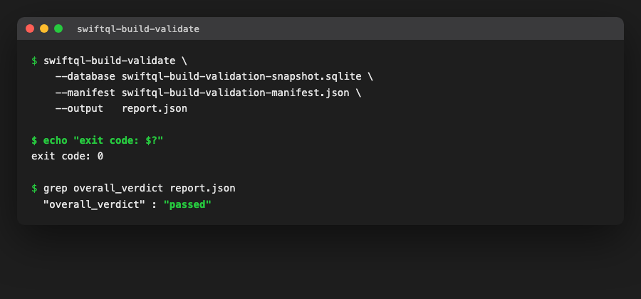

# Standalone SQLite Build Validator (#293)

This is the standalone SQLite static-query build validator recommended by
the [#132 research](SQLiteBuildValidation.md) and produced by
[#293](https://github.com/lukevanin/swiftql/issues/293), consuming the
[#292 manifest](SQLiteBuildValidationManifest.md) and an explicit checked-in
SQLite snapshot. It is a promotion of the already-validated `#132` research
prototype into a real product, adapted to consume
`SwiftQLSQLiteBuildValidationManifest` types instead of the prototype's own
local model.

The prototype itself was removed in v1.5.7 (#565). It was a file-for-file fork
of these targets that only ever drifted one way -- fixes landed here and were
never backported -- and both modules exported the same type names, so a target
importing both would not compile. The coverage it had and this validator did
not was ported first: the CLI output-safety preflight cases
(`SQLiteBuildValidationValidatorCLIOptionsTests`), the probe-level tests
(`SQLitePrepareV3ProbeTests`), the placeholder-scanner tests
(`SQLiteBuildValidationValidatorPlaceholderScannerTests`), and the binding-shape
and runtime-evidence cross-check cases in
`SQLiteBuildValidatorIntegrationTests`. The [#132 research
write-up](SQLiteBuildValidation.md) still describes the prototype's design; it
is the record of what was evaluated, not a pointer to live code.

## Package surface

`SwiftQLSQLiteBuildValidationValidator` (`Sources/SwiftQLSQLiteBuildValidationValidator`)
is a library target depending on `SwiftQLCore`, `SwiftQLSQLiteBuildValidationManifest`,
GRDB, and CSQLite. The `swiftql-build-validate` executable target
(`Sources/SwiftQLSQLiteBuildValidationValidatorCLI`) wraps it as the
`swiftql-build-validate` executable product. Target and product carry the same
name on purpose: the [#294 plugin](SQLiteBuildValidationPlugin.md) resolves
this executable through `context.tool(named:)`, and Xcode's build system cannot
find it when the two names disagree (#492).

```
swiftql-build-validate \
  --database  Northwind.sqlite \
  --manifest  build-validation-manifest.json \
  --output    report.json \
  [--plan-output plans.json]  # advisory query-plan sidecar (#394), opt-in
  [--plan-suppressions <path>]     # checked-in advisory suppressions (#395)
  [--plan-scan-row-threshold <n>]  # default 500
  [--codec <identity>]     # repeatable
  [--extension <name>]     # repeatable
  [--capability <id>]      # repeatable
```

`swiftql-index-advisor` reads the sidecar this writes and turns its verified
recommendations into a checked-in artifact; see
[Query-Plan Analysis and Index Advice](SQLiteQueryPlanAnalysis.md).

`--plan-output` adds the advisory query-plan sidecar described in
[Query-Plan Analysis and Index Advice](SQLiteQueryPlanAnalysis.md). It is
opt-in, writes a second file, and never changes the report or the exit code.

Exit code `0` only for an overall `passed` report; `1` for a report
containing `failed`/`unsupported`; `2` for anything that prevented producing
a report at all (bad arguments, unreadable manifest, I/O failure) — errors go
to stderr alongside the usage string.

## Quick start

Given a [#292 manifest](SQLiteBuildValidationManifest.md) and the checked-in
SQLite snapshot it describes, running the validator produces a canonical JSON
report and exits `0`:



If a query no longer matches the snapshot — a dropped table, a renamed
column, a missing capability — the run exits `1` and prints the offending
query's diagnostic to stderr so the failure is actionable without opening the
JSON report at all:

```
$ swiftql-build-validate --database northwind.sqlite --manifest manifest.json --output report.json
swiftql-build-validate: overall verdict failed
  plugin-fixture.missing-table: [failed] prepare.sqlite.prepare.failed: no such table: totally_missing_table
```

Every diagnostic line names a verdict and a `stage.code` pair; per-query
diagnostics (like the one above) are also prefixed with the failing
`queryID`, so a broken query can be traced straight back to the manifest
entry that declared it. Report-level diagnostics — not tied to any single
query — are printed the same way but without a `queryID` prefix. See
[the plugin doc](SQLiteBuildValidationPlugin.md#quick-start) for the same
two outcomes surfacing as an ordinary `swift build` pass/fail.

## What it proves, and what it doesn't

Owns one dedicated read-only, query-only `DatabaseQueue` for the entire run
(`PRAGMA query_only = ON`), verifies the snapshot is byte-identical before and
after validation, and refuses a snapshot with an adjacent `-journal`/`-shm`/
`-wal` sidecar. On that connection it prepares exactly one statement per
manifest entry with `sqlite3_prepare_v3` (via `SQLitePrepareV3Probe`), which
returns only copied Swift values — no `sqlite3_stmt` pointer, claim, or
serialized format ever escapes the probe, and every statement is finalized
exactly once on every path (success, inspection failure, or finalize
failure).

This proves: the SQL is one non-empty statement the real SQLite parser
accepts; referenced tables/columns/functions/collations resolve on that
connection; the C parameter index/name layout and result-column count/alias
agree with the manifest; declared capabilities are present in captured
runtime evidence; and the snapshot/SQLite build match recorded provenance.

It does **not** prove result values, row counts, application behavior,
runtime storage classes for dynamically typed expressions, general result
nullability, codec encode/decode behavior, or catalog/alias/nullability
semantics — those remain #214's responsibility (`delegatedChecks` on every
report names them explicitly so a reader knows what "passed" does not cover).

## Verdicts are fail-closed

`SQLiteBuildValidationVerdict` is `passed` / `failed` / `unsupported`. Only
`passed` is success — `unsupported` (a required capability or evidence
source was unavailable, so the declaration could not be proven) fails the
gate exactly like `failed`. An `unsupported` capability can never be
"spoofed" into passing: only genuinely opaque, non-observable capability IDs
(anything without a `function:`/`collation:`/`compile-option:`/`module:`/
`extension:` prefix, and not `sqlite-json-functions`) may be satisfied by
`SQLiteBuildValidationEnvironment.capabilityIDs`; an observable capability
(e.g. `function:FLOOR`) must actually be present in the connection's captured
`PRAGMA function_list` evidence.

A query whose preparation prerequisites are unavailable (missing dialect
capability, SQLite version, function, collation, module, or JSON-function
support) never reaches `sqlite3_prepare_v3` at all — it fails closed as
`unsupported` before preparation, rather than surfacing a confusing prepare
failure.

## Determinism

Same canonical-JSON contract as the manifest: `[.prettyPrinted, .sortedKeys,
.withoutEscapingSlashes]`, diagnostics sorted by `[queryID, code, stage,
resultCode, extendedResultCode, message]`, outcomes sorted by `queryID`, and
every evidence list (compile options, functions, collations, modules,
extension names, environment identifiers) sorted and deduplicated. No
timestamp, hostname, process ID, or local path exists anywhere in the report
schema — two runs against the same manifest, snapshot, SQLite build, and
capability registration produce byte-identical canonical JSON.

## Relationship to the #292 manifest

The manifest's own `validating()` already cross-checks declared parameters
against the raw SQL text (lexically) before the validator ever runs, so a
manifest that reaches this validator is already internally self-consistent.
What the validator adds is comparison against the **real SQLite parser**:
schema resolution, C-level bind/result metadata, and engine capability
evidence that no amount of manifest-level static checking can substitute
for. `query.minimumDialectVersion`, `query.conformanceFeatureIDs`, and the
other #292 fields carry straight through into report diagnostics/outcomes so
a failure links back to the originating #190/#191/#254 references.

## What this does not do

Per the #132 research decision, this module owns only the standalone
validation engine. It does not:

- provide a build-tool plugin or declare SwiftPM build-command inputs/outputs
  (owned by [#294](https://github.com/lukevanin/swiftql/issues/294));
- implement or lower the `@SQLQuery` macro (owned by #26);
- own catalog membership, table-reference binding, alias scopes, nullability
  propagation, or DML roles (owned by #214); or
- persist, reuse, or expose a serialized `sqlite3_stmt` at runtime.
