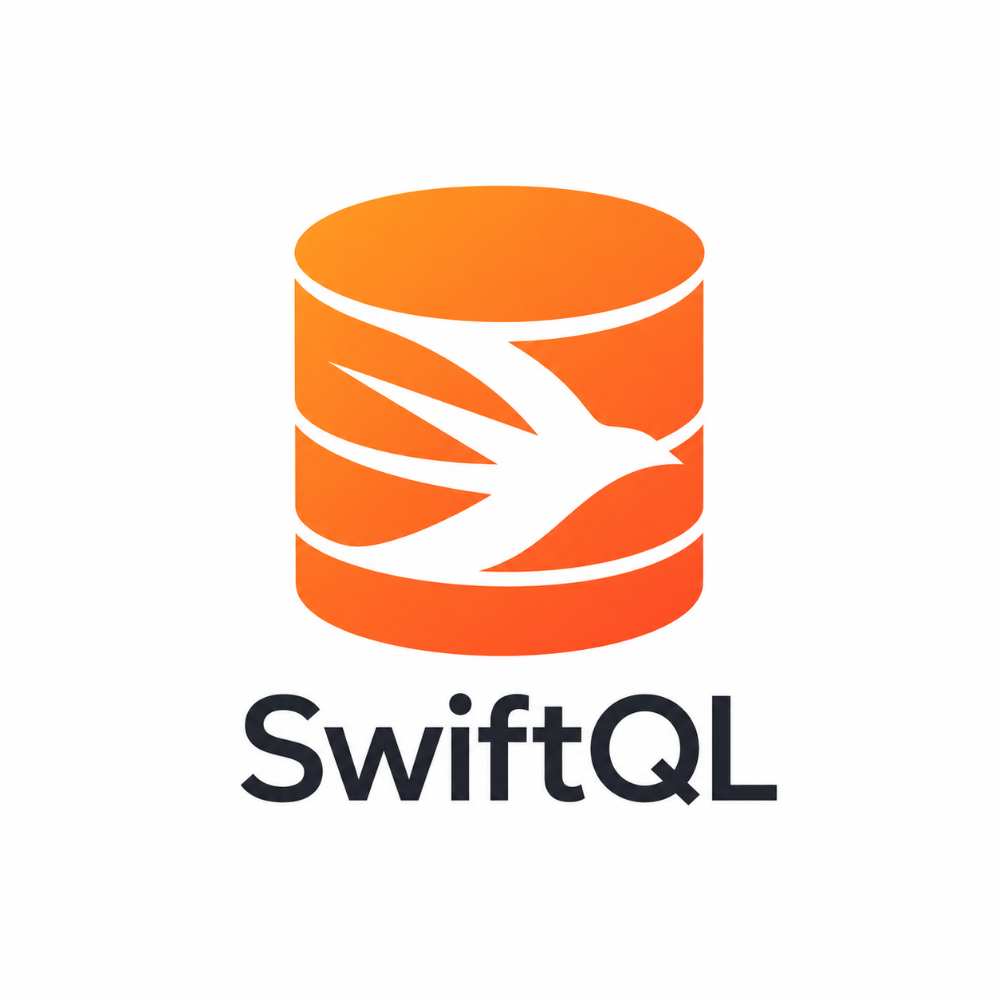

<p align="center">
  
</p>

<h1 align="center">SwiftQL</h1>

<p align="center">
  <strong>SQL, as a first-class language in Swift.</strong>
</p>

<p align="center">
  Real SQLite, written in typed, composable, refactorable Swift.<br>
  No raw query strings for supported queries. No stringly typed columns.<br>
  No ORM hiding the SQL.
</p>

<p align="center">
  <a href="https://github.com/lukevanin/swiftql/actions/workflows/swift.yml?query=branch%3Amain"></a>
  <a href="https://github.com/lukevanin/swiftql/actions/workflows/documentation.yml?query=branch%3Amain"></a>
  <a href="COMPATIBILITY.md#pinned-apple-support-points"></a>
  <a href="COMPATIBILITY.md#swift-6-series-coverage"></a>
  <a href="COMPATIBILITY.md#swift-6-series-coverage"></a>
  <a href="COMPATIBILITY.md#swift-6-series-coverage"></a>
  <a href="COMPATIBILITY.md#swift-6-series-coverage"></a>
  <a href="Package.swift"></a>
  <a href="https://swiftpackageindex.com/lukevanin/swiftql"></a>
  <a href="https://github.com/lukevanin/swiftql/releases"></a>
  <a href="LICENSE.md"></a>
</p>

## SQL belongs in the compiler

SQL is too important to bury in strings. SwiftQL takes a different approach:
it brings SQLite into Swift's type system using macros, generics, operators,
and result builders.

Tables are Swift structs. Columns are typed properties. Statements are values
written in SQL order. Selected rows decode back into the Swift type you asked
for.

<!-- test: XLDocumentationTests.testDocumentationREADME -->
```swift
import SwiftQL

@SQLTable
struct Person {
    var id: String
    var occupationId: String?
    var name: String
    var age: Int
}

let query = sql { schema in
    let person = schema.table(Person.self)
    Select(person)
    From(person)
    Where(person.name == "Fred")
}
```

That Swift expression emits recognizable SQLite:

```sql
SELECT t0.id AS id, t0.occupationId AS occupationId,
       t0.name AS name, t0.age AS age
FROM Person AS t0
WHERE (t0.name == 'Fred')
```

Create a request and execute it without leaving Swift's type system:

<!-- test: XLDocumentationTests.testDocumentationREADME -->
```swift
let request = database.makeRequest(with: query)

let people: [Person] = try request.fetchAll()
let firstPerson: Person? = try request.fetchOne()
```

`Select(person)` fixes the row type when the query is constructed, so both
execution methods expose their result types directly. There are no untyped row
dictionaries or manual result casts.

The `Where` clause is ordinary Swift, too:

<!-- test: XLDocumentationTests.testDocumentationREADME -->
```swift
Where(person.name == "Fred")
```

There is no `"name"` lookup string to mistype. Xcode can complete and navigate
the table model, while the compiler catches missing fields, incompatible
expression types, and invalid clause ordering. Rename a model property and the
compiler leads you to the queries affected by it.

If you know SQLite, you already know the shape of SwiftQL: `Select`, `From`,
`Join`, `Where`, `GroupBy`, `Having`, and `With` appear in SQL order and retain
their SQL meaning.

## What becomes first-class

- **[Tables](https://lukevanin.github.io/swiftql/documentation/swiftql/gettingstarted/)
  and [projections](https://lukevanin.github.io/swiftql/documentation/swiftql/queries/).**
  `@SQLTable` and `@SQLResult` derive typed table, column, and result metadata
  at compile time. There are no generated model files to keep in sync.
- **[Expressions](https://lukevanin.github.io/swiftql/documentation/swiftql/expressions/).**
  Compose boolean, numeric, text, optional, conditional, and aggregate
  expressions with Swift operators and generic constraints.
- **[Queries](https://lukevanin.github.io/swiftql/documentation/swiftql/queries/).**
  Build selects with inner, left, and cross joins; grouping and `HAVING`;
  ordering and pagination; scalar and table subqueries; compound queries; and
  ordinary or recursive common table expressions.
- **[Writes and table creation](https://lukevanin.github.io/swiftql/documentation/swiftql/gettingstarted/).**
  Create basic tables and construct typed inserts, updates, and deletes with
  the same SQL-shaped API.
- **[Bindings and results](https://lukevanin.github.io/swiftql/documentation/swiftql/gettingstarted/).**
  Keep invocation values in fresh immutable binding packets, then decode
  `fetchAll()` and `fetchOne()` results directly into Swift values.
- **[Static query contracts](https://lukevanin.github.io/swiftql/documentation/swiftql/staticqueries/).**
  Define database-independent SQL, parameter, result, identity, and cardinality
  metadata before opening a database, then prepare it against a compatible
  driver.
- **[Live data](https://lukevanin.github.io/swiftql/documentation/swiftql/livequeries/).**
  Observe typed query results through GRDB-backed Combine publishers that track
  the database region a query reads.
- **Your domain.** Extend SQLite with Swift enums, custom value types, and
  type-safe custom SQL functions.

## The v1.2 reusable-query boundary

SwiftQL v1.2 separates the reusable SQL contract from each database invocation.
An `XLStaticQueryDescriptor` contains rendered SQL, dialect requirements,
parameter and result layouts, stable identity, and cardinality; it contains no
database, connection, statement, or runtime value. Prepare that descriptor
against a `GRDBDatabase`, then create a fresh `XLInvocationBindings` value for
every call. Invocation values never become identifiers or SQL grammar tokens.

The products have distinct roles:

- `SwiftQLCore` exposes GRDB-free dialect, value, statement, binding, and driver
  contracts for adapter authors.
- `SwiftQL` is the application-facing product. It includes the macros, typed SQL
  DSL, contextual codecs, and the current GRDB-backed SQLite driver.

The existing `makeRequest(with:)`, named-binding, `XLCustomType`, and raw-value
APIs remain source-compatible throughout v1. High-level requests are
database-bound and the current `XLRequest` facade is not `Sendable`. Prefer a
static descriptor and its prepared handle when durable identity or cross-task
raw-value invocation matters. See the
[static-query guide](https://lukevanin.github.io/swiftql/documentation/swiftql/staticqueries/),
[prepared-statement boundaries](https://lukevanin.github.io/swiftql/documentation/swiftql/gettingstarted/),
and [contextual-codec migration](https://lukevanin.github.io/swiftql/documentation/swiftql/customtypes/)
for the complete contracts and current limitations.

## SQL-shaped, not ORM-shaped

SwiftQL does not replace the relational model with an object graph, and it does
not make SQL disappear. It preserves the database concepts that make SQL
powerful, then gives them native Swift names, types, composition, completion,
and refactoring support.

The boundary is deliberate. Swift checks the APIs, table fields, result shapes,
expression types, and supported statement composition that it can prove.
SQLite remains the authority for the live schema, runtime constraints,
coercion rules, and dialect-specific behavior. SwiftQL deliberately grows its
SQLite coverage without blurring that line.

## Installation

### Swift Package Manager

Add the following line to the `dependencies` section in your `Package.swift`
file:

```text
.package(url: "https://github.com/lukevanin/swiftql.git", from: "1.1.0")
```

`1.1.0` is the latest published package while the v1.2 changelog is marked
`Unreleased`. The examples above use APIs retained by v1.2. Adopt the new v1.2
static-query surface only after pinning a source revision intentionally or
after the `1.2.0` tag is published.

### Xcode

Refer to Apple's documentation [Adding package dependencies to your app](https://developer.apple.com/documentation/xcode/adding-package-dependencies-to-your-app#Add-a-package-dependency),
and specify the package URL `https://github.com/lukevanin/swiftql.git`. 

## Explore SwiftQL

Start with the
[documentation](https://lukevanin.github.io/swiftql/documentation/swiftql/).
Its examples are connected to executable test scenarios, so the API shown in
the guides stays aligned with the library.

For project guarantees and direction:

- [Compiler compatibility](COMPATIBILITY.md) records the supported Swift
  toolchains and reproducible CI matrix.
- [Changelog](CHANGELOG.md) distinguishes released behavior from the v1.2
  surface currently on `main` and records migration guidance.
- [Performance benchmarks](BENCHMARKS.md) measure query construction,
  preparation, caching, binding, execution, and decoding.
- [First-party source coverage](Coverage/README.md) preserves the reproducible
  coverage baseline and its raw evidence.
- The [roadmap](ROADMAP.md) tracks reliability, SQLite conformance, query
  declarations, Swift 6, and future database work.

For maintainers, [releasing SwiftQL](RELEASING.md) documents exact-tag
validation, artifact provenance, publication, verification, and recovery.

## License

MIT license. See [LICENSE.md](LICENSE.md).
