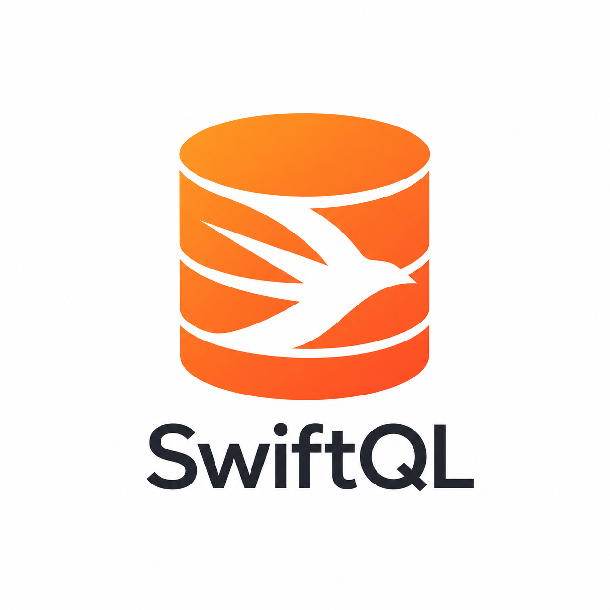

<p align="center">
  
</p>

<h1 align="center">SwiftQL</h1>

<p align="center">
  <strong>SQL, as a first-class language in Swift.</strong>
</p>

<p align="center">
  Real SQLite, written in typed, composable, refactorable Swift.<br>
  No raw query strings for supported queries. No stringly typed columns.<br>
  No ORM hiding the SQL.
</p>

<p align="center">
  <a href="https://github.com/lukevanin/swiftql/actions/workflows/swift.yml?query=branch%3Amain"></a>
  <a href="https://github.com/lukevanin/swiftql/actions/workflows/documentation.yml?query=branch%3Amain"></a>
  <a href="COMPATIBILITY.md#pinned-compiler-support-points"></a>
  <a href="COMPATIBILITY.md#swift-6-series-coverage"></a>
  <a href="COMPATIBILITY.md#swift-6-series-coverage"></a>
  <a href="COMPATIBILITY.md#swift-6-series-coverage"></a>
  <a href="COMPATIBILITY.md#swift-6-series-coverage"></a>
  <a href="COMPATIBILITY.md#pinned-compiler-support-points"></a>
  <a href="https://swiftpackageindex.com/lukevanin/swiftql"></a>
  <a href="https://github.com/lukevanin/swiftql/releases"></a>
  <a href="LICENSE.md"></a>
</p>

## SQL belongs in the compiler

SQL is too important to bury in strings. SwiftQL takes a different approach:
it brings SQLite into Swift's type system using macros, generics, operators,
and result builders.

Tables are Swift structs. Columns are typed properties. Statements are values
written in SQL order. Selected rows decode back into the Swift type you asked
for.

Concretely: **rename a column and the compiler finds every query that used it,
instead of your users finding them at runtime.** A string-based query survives
the rename, ships, and fails on a device you cannot reach.

<!-- test: XLDocumentationTests.testDocumentationREADME -->
```swift
import Foundation
import SwiftQL

@SQLTable
struct Person {
    var id: String
    var occupationId: String?
    var name: String
    var age: Int
}

let databaseURL = FileManager.default.temporaryDirectory
    .appendingPathComponent(UUID().uuidString)
    .appendingPathExtension("sqlite")
let database = try GRDBDatabase(url: databaseURL, logger: nil)

try database.makeRequest(with: sqlCreate(Person.self)).execute()

let query = sql { schema in
    let person = schema.table(Person.self)
    Select(person)
    From(person)
    Where(person.name == "Fred")
}
```

The temporary file keeps this example self-contained. In an application, use
your durable database URL and reuse one `GRDBDatabase` for that path. The basic
`sqlCreate` call uses `CREATE TABLE IF NOT EXISTS`; it creates this first table
but does not migrate an existing schema when `Person` changes.

That Swift expression emits recognizable SQLite:

```sql
SELECT t0.id AS id, t0.occupationId AS occupationId,
       t0.name AS name, t0.age AS age
FROM Person AS t0
WHERE (t0.name == 'Fred')
```

Create a request and execute it without leaving Swift's type system:

<!-- test: XLDocumentationTests.testDocumentationREADME -->
```swift
let request = database.makeRequest(with: query)

let people: [Person] = try request.fetchAll()
let firstPerson: Person? = try request.fetchOne()
```

`Select(person)` fixes the row type when the query is constructed, so both
execution methods expose their result types directly. There are no untyped row
dictionaries or manual result casts.

The `Where` clause is ordinary Swift, too:

<!-- test: XLDocumentationTests.testDocumentationREADME -->
```swift
Where(person.name == "Fred")
```

There is no `"name"` lookup string to mistype. Xcode can complete and navigate
the table model, while the compiler catches missing fields, incompatible
expression types, and invalid clause ordering. Rename a model property and the
compiler leads you to the queries affected by it.

If you know SQLite, you already know the shape of SwiftQL: `Select`, `From`,
`Join`, `Where`, `GroupBy`, `Having`, and `With` appear in SQL order and retain
their SQL meaning.

## Get started

### Install

Add the following line to the `dependencies` section in your `Package.swift`
file:

```text
.package(url: "https://github.com/lukevanin/swiftql.git", from: "1.5.5")
```

`1.5.5` is the latest published package. The examples above use APIs retained
by v1.3; the static-query surface remains available from version 1.2.0. Pin a
source revision only when intentionally testing later changes from `main`.

In Xcode, follow Apple's [Adding package dependencies to your app](https://developer.apple.com/documentation/xcode/adding-package-dependencies-to-your-app#Add-a-package-dependency),
and specify the package URL `https://github.com/lukevanin/swiftql.git`.

### Read the guide

**[Getting started](https://lukevanin.github.io/swiftql/documentation/swiftql/gettingstarted/)**
walks through defining a table, creating it, inserting, selecting, binding
values, updating, deleting, and grouping work in a transaction. It is the
fastest path from an empty file to a working query, and it doubles as a quick
reference afterwards.

From there:

- [Select queries](https://lukevanin.github.io/swiftql/documentation/swiftql/queries/)
  for joins, grouping, subqueries, and CTEs.
- [Declared queries](https://lukevanin.github.io/swiftql/documentation/swiftql/declaredqueries/)
  to write queries as ordinary Swift functions with `@SQLQuery`.
- [Advanced usage](https://lukevanin.github.io/swiftql/documentation/swiftql/advancedusage/)
  for connections, statement preparation, row lifetime, and the full
  transaction contract.
- The
  [full documentation](https://lukevanin.github.io/swiftql/documentation/swiftql/),
  whose examples are connected to executable test scenarios, so the API shown
  in the guides stays aligned with the library.

### Run it instead

[The Getting Started playground](Examples/README.md) is that same walkthrough
with the code running beside the explanation: nine pages against a real SQLite
file, from defining a table through inserting, selecting, updating, deleting,
named bindings, lazy result sets, and transactions, to observing a live query.
Open `Examples/SwiftQLExamples.xcworkspace`, build the `SwiftQLExamples` scheme
for My Mac, and step through it.

Each page prints its results and states the output it expects next to the code
producing it, so you can change a query and see immediately what moved.

### Read an application

[The to-do demo](Examples/TodoApp/README.md) is a SwiftUI app for iOS 17 and
macOS 14 whose entire data layer is SwiftQL. It shows the parts a guide covers
one at a time working together: a four-table schema with a many-to-many join,
declared `@SQLQuery` reads including a join and a grouped aggregate, one query
serving every filter, sort, and search combination, writes that return their
row through `RETURNING`, an atomic move between lists, and an interface fed
entirely by live queries — completing a to-do updates the list and the sidebar
counts with no reload call anywhere. Queries are checked against a schema
snapshot at build time, and 62 tests cover the query layer.

Open `Examples/TodoApp/TodoApp.xcodeproj` and run the **TodoApp** scheme.

## What's new

[WHATSNEW.md](WHATSNEW.md) describes each release in plain language — what you
can do that you could not before, and whether it affects code you already
wrote. [CHANGELOG.md](CHANGELOG.md) remains the exact record.

## How SwiftQL compares

Swift has good persistence libraries. They differ mainly in how much of the
relational model they ask you to give up.

| | Shape | Where the SQL lives | Type safety comes from |
|---|---|---|---|
| **SwiftQL** | Result builder, one clause per statement in SQL order | Visible, in SQL order, in Swift | Macros + generics, checked at compile time |
| **StructuredQueries** | Chained methods with typed closures and key paths | Emitted in SQL order; `#sql` escape hatch for typed SQL strings | `@Table` macro + key paths |
| **GRDB** | Records + query interface, with raw SQL always available | Visible when you write it; strings when you drop down | Codable records and column definitions |
| **SQLite.swift** | Expression DSL | Behind the DSL | Generic `Expression` types |
| **SwiftData** | Object graph | Hidden - no SQL surface | `@Model` macro over an opaque store |
| **Fluent** | Server-side ORM | Hidden behind the model layer | Model definitions and property wrappers |

**SwiftQL is not a GRDB alternative - it is a typed query layer above it.**
Execution, connection management, transactions, and observation are GRDB's,
and deliberately so: that part is mature, well understood, and not worth
reimplementing. SwiftQL replaces the part where queries become strings.

**What sets SwiftQL apart is positional correspondence with SQL.** Every other
typed query library in this table reaches SQL through a method chain: you start
from a table type and attach clauses to it, in an order the library accepts
rather than the order SQL defines. SwiftQL writes each clause once, under its
SQL name, in SQL's grammatical order. The Swift source and the statement it
produces have the same shape.

That is what makes porting mechanical rather than interpretive. A query moves
between SQL and SwiftQL a clause at a time, in both directions, without first
being redesigned into somebody's builder vocabulary. The
[porting guide](Documentation/PortingFromSQL.md) is the proof: a clause-by-clause
mapping table, worked ports up to recursive common table expressions, and an
explicit list of the places the correspondence is not exact.

### Choose something else when

- **You need schema migrations.** SwiftQL does not provide them. `sqlCreate`
  creates a table but does not migrate an existing schema. Use GRDB's
  `DatabaseMigrator` alongside SwiftQL - they compose, because SwiftQL sits on
  GRDB rather than replacing it.
- **You prefer a chained query builder.** Several Swift libraries express typed
  queries as method chains. If `.select { }.where { }` reads better to you than
  `Select` / `From` / `Where`, that preference is the whole argument.
- **You want the database to disappear.** SwiftData is a better fit if you
  would rather model an object graph than think about tables, and you can
  require recent Apple platforms.
- **You are writing a server with a non-SQLite backend.** Fluent covers
  PostgreSQL and MySQL today. SwiftQL is SQLite-only; other dialects are
  [roadmap](ROADMAP.md) work, not shipped work.
- **Your queries are already written and working.** The cost of SwiftQL is
  learning its expression surface. The benefit arrives when the schema
  changes, so a stable schema you rarely touch may not repay it.

## What becomes first-class

- **[Tables](https://lukevanin.github.io/swiftql/documentation/swiftql/gettingstarted/)
  and [projections](https://lukevanin.github.io/swiftql/documentation/swiftql/queries/).**
  `@SQLTable` and `@SQLResult` derive typed table, column, and result metadata
  at compile time. There are no generated model files to keep in sync.
- **[Expressions](https://lukevanin.github.io/swiftql/documentation/swiftql/expressions/).**
  Compose boolean, numeric, text, optional, conditional, and aggregate
  expressions with Swift operators and generic constraints.
- **[Queries](https://lukevanin.github.io/swiftql/documentation/swiftql/queries/).**
  Build selects with inner, left, and cross joins; grouping and `HAVING`;
  ordering and pagination; scalar and table subqueries; compound queries; and
  ordinary or recursive common table expressions.
- **[Writes and table creation](https://lukevanin.github.io/swiftql/documentation/swiftql/gettingstarted/).**
  Create basic tables and construct typed inserts, updates, and deletes with
  the same SQL-shaped API.
- **[Bindings and results](https://lukevanin.github.io/swiftql/documentation/swiftql/gettingstarted/).**
  Keep invocation values in fresh immutable binding packets, then decode
  `fetchAll()` and `fetchOne()` results directly into Swift values.
- **[Static query contracts](https://lukevanin.github.io/swiftql/documentation/swiftql/staticqueries/).**
  Define database-independent SQL, parameter, result, identity, and cardinality
  metadata before opening a database, then prepare it against a compatible
  driver.
- **[Live data](https://lukevanin.github.io/swiftql/documentation/swiftql/livequeries/).**
  Observe typed query results through GRDB-backed Combine publishers that track
  the database region a query reads, or adopt `XLQueryObserver`/
  `XLQueryRowObserver` directly with SwiftUI's `@StateObject`/`@ObservedObject`.
- **Your domain.** Extend SQLite with Swift enums, custom value types, and
  type-safe custom SQL functions.

## SQL-shaped, not ORM-shaped

SwiftQL does not replace the relational model with an object graph, and it does
not make SQL disappear. It preserves the database concepts that make SQL
powerful, then gives them native Swift names, types, composition, completion,
and refactoring support.

The boundary is deliberate. Swift checks the APIs, table fields, result shapes,
expression types, and supported statement composition that it can prove.
SQLite remains the authority for the live schema, runtime constraints,
coercion rules, and dialect-specific behavior. SwiftQL deliberately grows its
SQLite coverage without blurring that line.

## Project guarantees and direction

- [Design rationale](Documentation/DESIGN.md) explains why SwiftQL is
  SQL-shaped, why queries are result builders in SQL order, why column values
  are Swift types rather than SQLite types, and what those choices cost.
- [Compiler compatibility](COMPATIBILITY.md) records the supported Swift
  toolchains and reproducible CI matrix.
- [SQLite conformance](COMPATIBILITY.md#sqlite-conformance-inventory) records
  the evidence boundary for SwiftQL's currently supported public subset.
- [Changelog](CHANGELOG.md) records released behavior and the unreleased v1.3
  evidence milestone.
- [Performance benchmarks](BENCHMARKS.md) measure query construction,
  preparation, caching, binding, execution, and decoding.
- [First-party source coverage](Coverage/README.md) preserves the reproducible
  coverage baseline and its raw evidence.
- The [roadmap](ROADMAP.md) tracks reliability, SQLite conformance, query
  declarations, Swift 6, and future database work.

For maintainers, [releasing SwiftQL](RELEASING.md) documents exact-tag
validation, artifact provenance, publication, verification, and recovery.

## License

MIT license. See [LICENSE.md](LICENSE.md).
